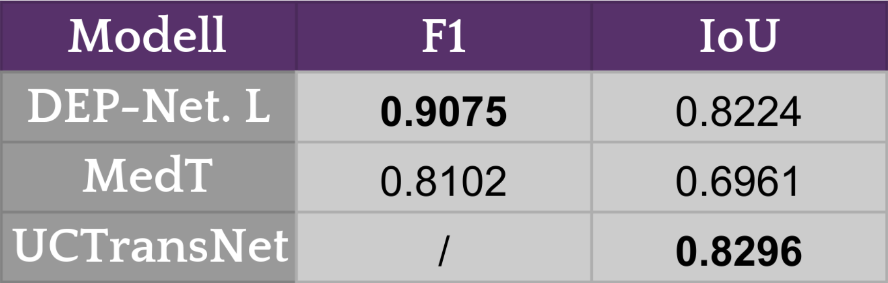
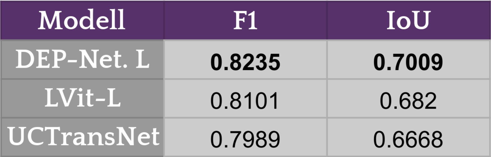

## Ergebnisse
### CRAG

Das DEPooling-Net zeigte beeindruckende Ergebnisse auf drei wichtigen Datensätzen für die Krebsdiagnostik. Auf dem CRAG-Datensatz, der die Segmentierung von Dickdarmdrüsen betrifft, erreichte es mit einem Dice-Score von 0.91 und dem höchsten F1-Score von 0.914 die Spitzenklasse, knapp hinter dem PatchCL-Netzwerk [1]. Es erzielte die beste Leistung bei der Unterscheidung zwischen Drüsen und Hintergrund.

---

### GlaS

Beim GlaS-Datensatz für die Segmentierung von Drüsen in der Kolon-Pathologie erreichte das DEPooling-Net ebenfalls den höchsten F1-Score von 0.9075 und einen IoU-Wert von 0.8224, knapp hinter dem UCTransNet [2], schlägt jedoch das MedT [3], welches eine Transformer-Architektur für den Bereich der medizinischen Sementierung, darstellt.

---

### MoNuSeg

 Schließlich setzte das DEPooling-Net beim MoNuSeg-Datensatz, der sich mit der Segmentierung von Zellkernen in verschiedenen Organen beschäftigt, den Maßstab mit dem höchsten F1-Score von 0.8235 und einem IoU-Wert von 0.7009, was es zum führenden Modell in dieser Kategorie macht. Diese Ergebnisse unterstreichen die Effektivität des DEPooling-Nets in der präzisen Krebsdiagnostik und -behandlung. Hierbei hat es sich ebenfalls gegenüber bestehenden Architekturen, vorallem Transformer-Architekturen [4, 2] durchgesetz.

---

### Tissue-Net
Auf dem TissueNet-Datensatz, der sich durch die Anwendung von Multiplex-Imaging-Techniken von anderen Datensätzen unterscheidet und eine geringere Farbvielfalt bietet, lieferte das DEPooling-Net herausragende Ergebnisse in der binären Segmentierung. Durch die Augmentation auf 20,640 Datenpunkte und Tests an 1,324 Datenpunkten erreichte unser Modell einen Dice-Score von 0.9052 und einen IoU-Score von 0.846. Diese Leistung unterstreicht die Fähigkeit des Modells, auch unter herausfordernden Bedingungen präzise Ergebnisse zu liefern.

---

## Ablation
Unsere Forschung präsentiert verschiedene neuronale Netzwerke mit DEPooling-Layern, um die Balance zwischen Effizienz und Leistungsfähigkeit zu optimieren. Das DEPooling-Net S/M, mit 1,7 Millionen Parametern und 6,95 MB Größe, bietet trotz seiner Kompaktheit hervorragende Durchgangsraten. Ein anderes Modell, basierend auf dem MobileNetV2 für das HistoSeg-Segmentationsnetzwerk 2, hat 3,641 Millionen Parameter, eine schnelle Inferenzzeit von unter 200 ms, aber liefert die geringsten Ergebnisse, übertrifft jedoch das HistoSeg-Modell um 3 Prozentpunkte. Das umfangreichste Modell, das DEPooling-Net L, mit 39,853,665 Parametern, zeichnet sich durch seine herausragenden Ergebnisse und effizienten Speicherbedarf von 1711,8 MB aus. Experimente zeigen, dass der Einsatz mittlerer DEPooling-Schichtausgänge und zunehmender Dilationsraten in tieferen Schichten die Leistung verbessert. Auch die Integration von Attention-Mechanismen, einschließlich solcher aus Transformer-Architekturen, wurde untersucht, wobei ein verkürztes Decoder-Modul, das eine signifikante Reduktion der Modellparameter ermöglicht, ohne die Leistung wesentlich zu beeinträchtigen, hervorgehoben wurde. Dieser Ansatz ist besonders wertvoll für effizienz- und ressourcenoptimierte Anwendungen.

---

[1] Hritam Basak, Zhazhen Yin. https://openaccess.thecvf.com//content/CVPR2023/papers/Basak_Pseudo-Label_Guided_Contrastive_Learning_for_Semi-Supervised_Medical_Image_Segmentation_CVPR_2023_paper.pdf 

[2] Haonan Wang, Peng Cao, Jiaqi Wang, Osmar R. Zaiane. https://arxiv.org/abs/2109.04335 

[3] Jeya Maria Jose Valanarasu, Poojan Oza, Ilker Hacihaliloglu, and Vishal M.
Patel. https://arxiv.org/pdf/2102.10662v2.pdf 

[4] Zihan Li, Yunxiang Li, Qingde Li, Puyang Wang, Dazhou Guo, Le Lu, Fellow, 
Dakai Jin, You Zhang, Qingqi Hong. https://arxiv.org/pdf/2206.14718v4.pdf 