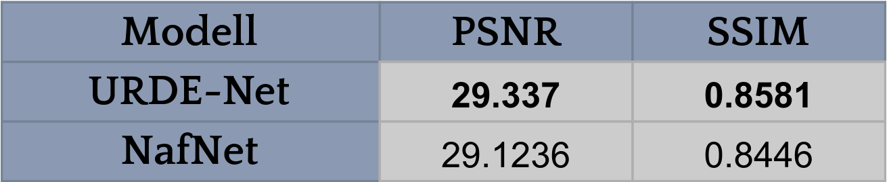
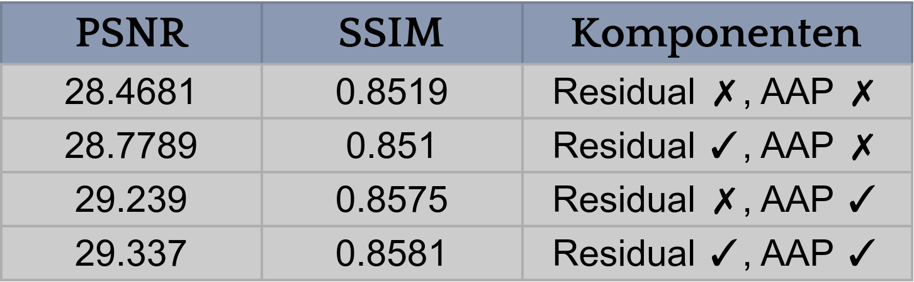

## Ergebnisse

Für die Evaluierung unseres neu entwickelten Modells wurde ein spezifischer, sorgfältig kuratierter Datensatz genutzt, der für die anspruchsvollen Testanforderungen konzipiert wurde. Durch direkte Vergleichstests mit dem NafNet [1], ohne vorheriges Pre-Training, zielten wir darauf ab, die genuine Leistung und Adaptivität unserer Modelle zu messen. Diese Strategie ermöglichte eine authentische Bewertung der Modellwirksamkeit unter realen Bedingungen. Unser Modell übertraf den aktuellen Technikstand in Schlüsselmetriken wie der Peak Signal-to-Noise Ratio (PSNR) und dem Structural Similarity Index Measure (SSIM), welche für die Beurteilung der Bildqualität in Bezug auf Wiedergabetreue und strukturelle Ähnlichkeit entscheidend sind.

---

## Ablation

Beim Entwickeln des URDE-Nets lag der Fokus darauf, ein effizientes Restaurationsnetzwerk unter Berücksichtigung begrenzter Rechenkapazitäten zu schaffen. Inspiriert von Chen et al. im NafNet [1], verbesserten wir die Effizienz durch Eliminierung redundanter Aktivierungsfunktionen. Spezifische Anpassungen beinhalteten das Entfernen von Tiefenaktivierungsfunktionen nach Convolutional Layers, die Reduktion der Restaurationsblöcke auf eine einzige Residual Unit und das Deaktivieren des Adaptive-Average-Pooling-Layers. Diese Änderungen führten zu einer deutlichen Reduzierung der Modellparameter und des Speicherverbrauchs, bei nur minimaler Beeinträchtigung der Modellleistung. Zusätzlich steigerten wiederkehrende Einheiten und ein alternativer Attention-Mechanismus die Leistungsfähigkeit des URDE-Nets weiter, ohne die Modellkomplexität erheblich zu erhöhen. Die Integration von Depthwise-Separable-Convolutions ersparte zusätzliche Parameter, ohne Performanceverluste hinzunehmen.

---

[1] Liangyu Chen, Xiaojie Chu, Xiangyu Zhang, Jian Sun. https://arxiv.org/abs/2204.04676 
