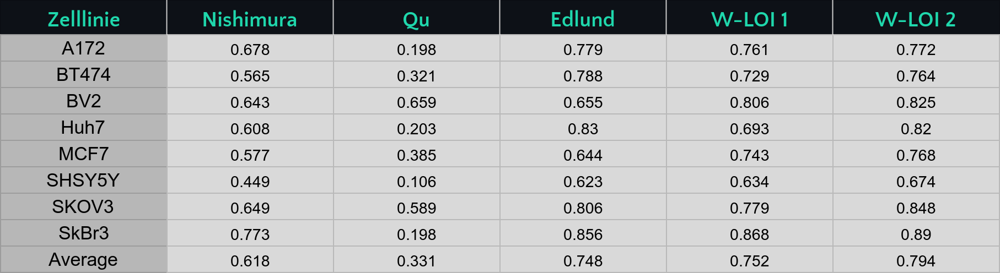
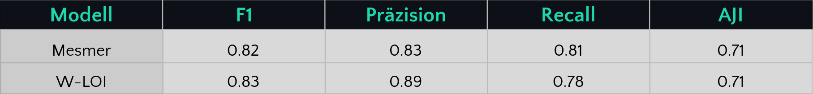
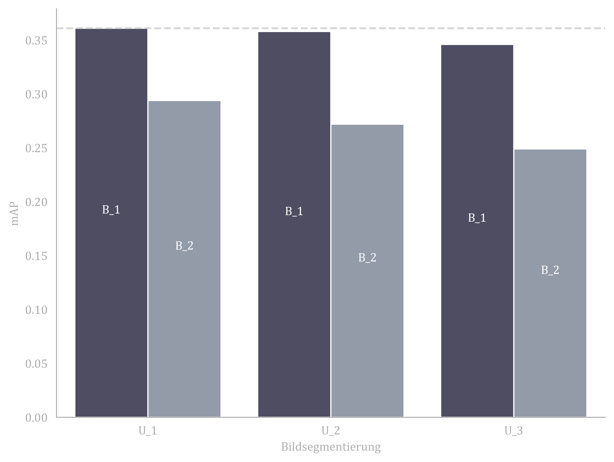
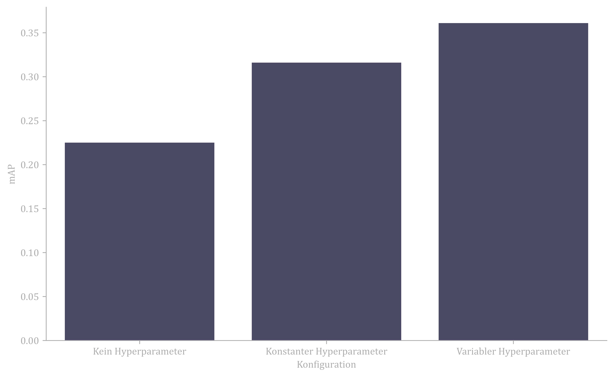

## Ergebnisse
### LIVECell

In der vorliegenden Studie werden diverse maschinelle Lernmodelle anhand des LIVECell-Datensatzes evaluiert, einem der umfangreichsten annotierten Zelldatensätze, der acht unterschiedliche Zelllinien mit insgesamt etwa 1,6 Millionen Zellen umfasst.

Die Modelle von Nishimura et al. und Qu et al. repräsentieren aktuelle weakly-supervised Ansätze in diesem Forschungsfeld, während das Modell von Edlund et al. als fully-supervised Benchmark dient.

Die Überlegenheit unserer Modelle W-LOI 1 und W-LOI 2 im Vergleich zu anderen weakly-supervised Modellen ist offensichtlich, da sie durchgängig bessere Ergebnisse liefern. Darüber hinaus erreichen unsere Modelle häufig Leistungen, die mit dem fully-supervised Ansatz von Edlund et al. vergleichbar oder sogar überlegen sind. Die Unterschiede zwischen W-LOI 1 und W-LOI 2 sind auf die jeweiligen Trainingsbedingungen zurückzuführen: W-LOI 1 wurde ausschließlich mit dem LIVECell-Datensatz trainiert, während W-LOI 2 zusätzlich mit Daten aus einem anderen Datensatz vortrainiert wurde, was dessen Leistungsstärke weiter erhöht.

---

### TissueNet

TissueNet ist, ähnlich wie der LIVECell-Datensatz, ein vollständig annotierter Datensatz. Allerdings ist der Umfang von TissueNet geringer als der von LIVECell. Dennoch ist es wichtig, TissueNet zu testen, da sich die Bildmodalitäten unterscheiden.

Beim W-LOI übertrifft dieser die Basislinie, allerdings fällt auf, dass der Recall-Wert vergleichsweise niedrig ist.

---

## Ablation 

Ablation im Bereich der Künstlichen Intelligenz (KI) und Maschinelles Lernen (ML) bezieht sich auf einen experimentellen Ansatz, bei dem systematisch Komponenten entfernt oder deaktiviert werden, um deren Einfluss auf die Leistungsfähigkeit des Gesamtsystems zu untersuchen. Dieser Prozess hilft dabei, die Wichtigkeit und den Beitrag spezifischer Teile eines KI-Modells oder -Algorithmus zu verstehen.

Bei einer Ablationsstudie wird typischerweise mit einem vollständig funktionierenden KI-Modell begonnen. Anschließend werden nacheinander einzelne Komponenten entfernt oder verändert. Nach jeder Änderung wird die Leistung des Modells erneut bewertet. Durch den Vergleich der Leistungsindikatoren vor und nach der Entfernung kann festgestellt werden, wie wichtig die jeweilige Komponente für die Aufgabe ist, für die das Modell entwickelt wurde.

### Größe des Auxnet

Für Leser könnte es zunächst überraschend erscheinen, warum die Kapazität des Auxnet so begrenzt ist. Das Auxnet setzt sich aus zwei Komponenten zusammen: einer für die Randsegmentierung und einer für die semantische Segmentierung. Dabei ist das Randsegmentierungsnetzwerk entweder ein einfaches CNN oder ein U-Net, während das semantische Segmentierungsnetzwerk ein kleines oder großes U-Net darstellt.

Aus dem Balkendiagramm geht hervor, dass die kleineren Netzwerke die besten Leistungen erbringen. Dies lässt sich dadurch erklären, dass das Modell nicht isoliert betrachtet werden sollte. In Verbindung mit dem Segmentierungsnetzwerk hat das Auxnet lediglich die Funktion, den Suchraum zu reduzieren. Ein zu umfangreiches Netzwerk würde den Suchraum übermäßig einschränken, was wiederum die Leistungsfähigkeit mindert.

Dieser Prozess wird in der untenstehenden Abbildung verdeutlicht. Fehler in der Randsegmentierung werden durch das U-Net in Kombination mit der Anpassung durch das Segmentierungsnetzwerk korrigiert.

### Einfluss des Hyperparameters

Bei der Entwicklung der Instanzsegmentierung durch das Segmentierungsnetzwerk kommt der Hyperparameter cc zum Einsatz. Er dient der Abschätzung der erwarteten Zellgröße. Diese Notwendigkeit ergibt sich aus der Beschaffenheit der Anmerkungen: Die Tensoren, die die Positionen angeben, liefern lediglich Aufschluss über den Standort der Zellen, jedoch nicht über deren Umfang. Aus diesem Grund nutzt man den Hyperparameter cc, um eine Einschätzung bezüglich der Dimensionen der Zellen vorzunehmen.

--- 

[1] Kazuya Nishimura, Ryoma Bise. https://ieeexplore.ieee.org/document/10030481

[2] Hui Qu, Pengxiang Wu, Qiaoying Huang, Jingru Yi, Zhennan Yan, Kang Li, Gregory M Riedlinger, Subhajyoti De, Shaoting Zhang, Dimitris N Metaxas. https://pubmed.ncbi.nlm.nih.gov/32746112/
[3] Christoffer Edlund, Timothy R Jackson, Nabeel Khalid, Nicola Bevan, Timothy Dale, Andreas Dengel, Sheraz Ahmed, Johan Trygg, Rickard Sjögren. https://pubmed.ncbi.nlm.nih.gov/34462594/

