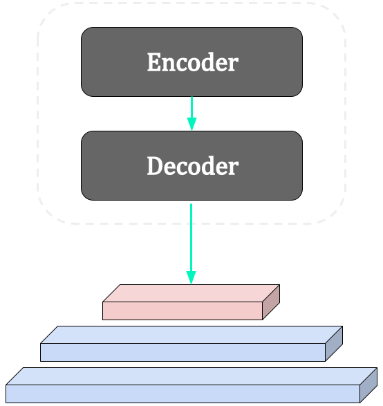
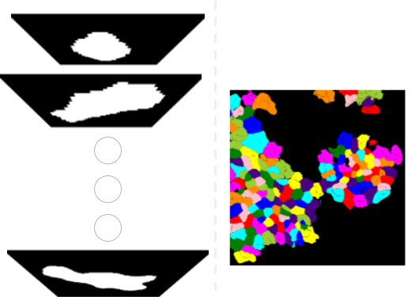

## Encoder/Decoder-Struktur
  
Das Backbone-Modul verwendet eine Encoder/Decoder-Struktur, die essentiell für die Generierung von Feature-Repräsentationen des Eingabebildes in verschiedenen Auflösungen ist. Dies ermöglicht eine tiefergehende Analyse und Verarbeitung der Bilddaten. Die Bildeigenschaften sind in hellblau dargestellt. Die oberste Ebene, welche die Eigenschaften mit der niedrigsten Auflösung beinhaltet, ist hellrot gefärbt.

### Encoder
Das Backbone-Moduls des Encoders basiert auf ConvNeXt der Architektur, die für eine effiziente und effektive Feature-Extraktion aus den Eingabebildern sorgt. ConvNeXt ist speziell für die tiefgehende Analyse und Verarbeitung visueller Daten konzipiert und ermöglicht es, komplexe Muster und Strukturen in den Bildern zu erkennen und zu kodieren.

### Decoder
Für den Decoder-Teil wird ein Feature-Pyramid-Network (FPN) eingesetzt. Das FPN integriert die vom Encoder generierten Features auf verschiedenen Ebenen, um eine reichhaltige und skalierungsübergreifende Repräsentation zu erzeugen, die für die nachfolgenden Segmentierungsaufgaben nützlich ist.

---

## Grundlagen und Architektur des PPN

Das W-LOI-Net setzt auf ein Position-Proposal-Network (PPN), ein spezielles Convolutional-Neural-Network (CNN), das für weakly-supervised und unsupervised Training entwickelt wurde. Im Gegensatz zu herkömmlichen Region-Proposal-Networks (RPN) verzichtet das PPN auf die Nutzung von Bounding-Boxes und konzentriert sich ausschließlich auf die Bestimmung der Position von Locations of Interest (LOIs). Dies erfolgt durch die Erzeugung zweier Tensoren: Ein Bewertungstensor (S) für die Bewertung potenzieller Positionen und ein Tensor für Verschiebungsregressionen (R), die von einem 2D-Gitter des Originalbildes abgeleitet sind.

### Training und Segmentierung im PPN
Für das Training des PPN werden zusätzliche Ground-Truth-Tensoren genutzt, um den PPN-Verlust zu bestimmen. Dabei wird ein Blob-Detection-Algorithmus eingesetzt, um bei vollständig annotierten Daten oder im weakly-supervised Training die Positionen zu identifizieren. Die Segmentierung erfolgt durch die Verwendung der detailliertesten Bildeigenschaften. Ein Schlüsselelement ist die gezielte Aufhebung der Translationsinvarianz im CNN durch Hinzufügung der Positionsdaten. Dies ermöglicht eine präzise Segmentierung, indem das Netzwerk spezifisch auf die Position jeder Zelle im Bild reagiert.

### Positionstensor
Der Output-Positionstensor kodiert präzise die räumlichen Koordinaten der Locations of Interest (LOIs) im Bildgitter. Er ermöglicht es dem Convolutional Neural Network (CNN), spezifische Bildbereiche für detaillierte Analysen oder Segmentierungen zu fokussieren, indem er die Translationsinvarianz des Netzwerks gezielt aufhebt. Dadurch wird eine hochpräzise Lokalisierung und Segmentierung von Objekten in komplexen Bildszenarien erreicht.

---

## Architektur des Segmentierungsnetzwerks
  
Das Segmentierungsnetzwerk ist ein spezialisiertes Fully-Convolutional-Network (FCN) für Zellsegmentierung. Es kombiniert Eigenschafts- und Positionstensoren, wobei in den ersten Schichten Positionstensoren ignoriert werden, um Effizienz und Speicher zu optimieren. In den letzten Schichten wird der Positionstensor für eine genauere Segmentierung hinzugefügt. Zudem werden Daten um die Lokalisationen von Interesse (LOIs) zu kleineren Patches zurechtgeschnitten, was unnötige Berechnungen reduziert. Die finale Schicht skaliert das Bild mittels Transposed Convolution zurück auf Originalgröße.

### Kernaspekte des Segmentierungsprozesses
Die Effizienz des Netzwerks basiert auf der frühen Ignorierung und späteren Einbeziehung der Positionstensoren, was zu präziser Lokalisierung und Segmentierung führt. Das Zurechtschneiden der Daten fokussiert auf die relevante Zellregion, wodurch die Genauigkeit erhöht und Ressourcen gespart werden. Die abschließende Skalierung stellt die ursprüngliche Bildgröße sicher und bewahrt die Bildqualität.
