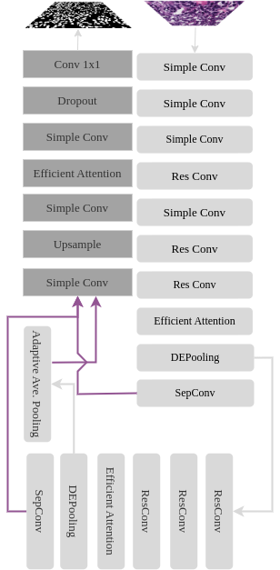

  

### Encoder:
Der Encoder, dargestellt in hellgrau, ist aus mehreren Modulen zusammengesetzt, die schrittweise tiefer in das Netzwerk führen. Jedes Modul verfeinert und verdichtet die Informationen weiter. Am Ende des Encoders werden die Ergebnisse aller Stufen zu einer kompakten Merkmalskarte zusammengefasst, die anschließend an den Decoder übergeben wird.

### Decoder:
Der Decoder-Teil, in dunkelgrau gehalten, zielt darauf ab, aus der vom Encoder übermittelten Merkmalskarte eine sinnvolle Ausgabe zu rekonstruieren. Im Gegensatz zum Encoder sind die Prozesse hier darauf ausgelegt, die Dimensionalität und die räumliche Auflösung der Merkmale zu erhöhen, um ein endgültiges Ergebnis, wie beispielsweise ein Bild, zu formen.

### Architektur: 
Das DEPooling-Net ist durch mehrere Stufen charakterisiert, die das Netzwerk grafisch in die Breite ziehen. Anstatt jede Stufe des Encoders mit einer entsprechenden Stufe des Decoders zu verknüpfen, erfolgt eine Konkatenation, um alle Features jeder Stufe in einer Feature-Map zu vereinen. Diese Feature-Map wird dann in den Decoder überführt und kann als komplette Sammlung der bis dato extrahierten Features betrachtet werden. Im Encoder werden nicht die Features der SepConvs, sondern jene der DEPooling-Module für die Weiterverarbeitung verwendet, da dies zu besseren Ergebnissen führt. Die im Decoder verarbeiteten Features werden schließlich an die Dimensionen des Inputs angepasst. Optional können in den oberen Teil des Decoders zusätzliche Features aus dem Encoder eingespeist werden, um potentiellen Informationsverlust zu minimieren.
