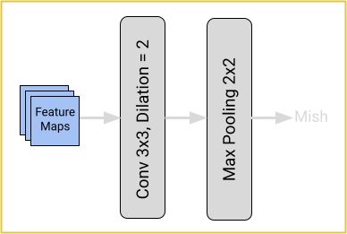

  
### Simple-Conv-Modul:
Das Simple-Conv-Modul ist ein zentraler Bestandteil vieler Module im DEPooling-Net. Es zielt darauf ab, Features zu extrahieren und die Eingabedaten in tiefere Dimensionen zu transformieren. Dies wird durch die Verwendung einer 3x3 Convolution erreicht, gefolgt von Batch-Normalisierung und der Mish-Aktivierungsfunktion.

---

  
### Res-Conv-Modul:
Im DEPooling-Net spielt das Res-Conv-Modul, ein Residual-Modul, eine Schlüsselrolle, da es als essenzieller Bestandteil in modernen CNN-Architekturen gilt. Diese Module verbessern nicht nur die Feature-Extraktion signifikant, sondern tragen auch zur Netzwerkstabilität bei, indem sie den Gradientenfluss optimieren. Die Integration von Skip-Connections, die Informationen aus früheren Schichten mit denen tieferer Schichten effizient verknüpfen, ist dabei von besonderer Bedeutung. Durch die Einführung von Dilatation erweitern diese Module das rezeptive Feld und ermöglichen eine genauere Feature-Extraktion, wobei die Genauigkeit durch sorgfältige Implementierung gewahrt wird.

---

  
### Adaptive-Average-Pooling:
Das Adaptive-Average-Pooling-Modul kommt im unteren Teil des Decoders zum Einsatz. Es extrahiert wichtige Features der zuvor erfassten Merkmale, unabhängig von der Eingabegröße. Im DEPooling-Net dient es dazu, die Höhe und Breite der Features auf ein Minimum zu reduzieren.

---

  
### DEPooling:
Durch die Nutzung dilatierter Convolutions erweitert das DEPooling-Modul das rezeptive Feld, um Informationsverlust zu minimieren. Diese Technik fängt Kontextinformationen detailliert auf, ohne die räumliche Auflösung des Inputs zu beeinträchtigen. Eine nachfolgende Max-Pooling-Schicht reduziert die Dimensionen, während essentielle Merkmale erhalten bleiben. Die Mish-Aktivierungsfunktion verarbeitet diese Outputs weiter und unterstützt eine effiziente Neuronenaktivierung. Das DEPooling-Modul erhält so die Detailtreue des Inputs bei gleichzeitiger Optimierung für nachfolgende Schichten.

---

  
### Depthwise-Separable-Convolution:
Diese Technik unterteilt sich in zwei Schritte: Zuerst wird eine Depthwise-Convolution durchgeführt, wobei jeder Eingangskanal separat mit einer 3x3 gruppierten Convolution bearbeitet wird. Die Gruppierung basiert auf dem größten gemeinsamen Teiler von Eingangs- und Ausgangskanälen. Anschließend erfolgt eine Pointwise-Convolution mit einer 1x1 Convolution, die die Ergebnisse der Depthwise-Convolution zusammenführt, um die Netzwerktiefe zu erhöhen und komplexere Features zu extrahieren. In unserer Architektur ersetzen dilatierte Convolutions herkömmliche Convolutions, wobei jeder Depthwise-Convolution-Schicht eine spezifische Dilationsrate zugeordnet ist, die in tieferen Schichten progressiv ansteigt, um eine differenzierte und effiziente Extraktion von Merkmalen aus den Eingabe-Feature-Maps zu ermöglichen.
