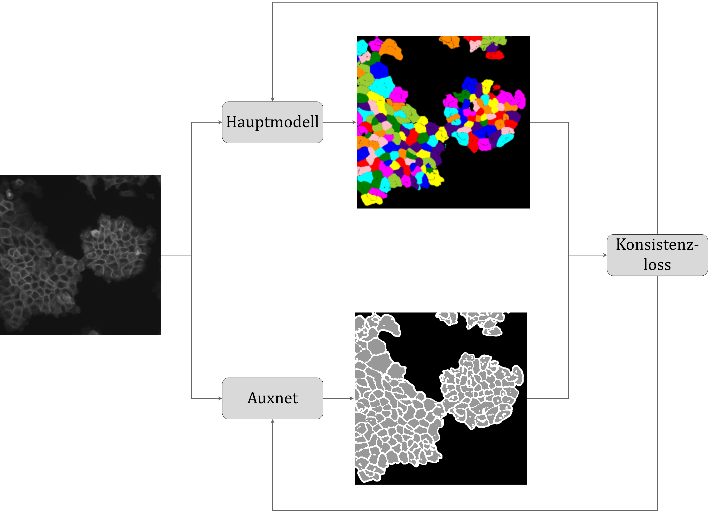

## Wissenstransfer
Das Konzept des Wissenstransfers, basierend auf der Methode der Wissensdestilierung, wie sie von Hinton et al. eingeführt wurde, zielt darauf ab, Wissen von einem größeren, komplexeren Modell (dem "Lehrer") auf ein kleineres, effizienteres Modell (den "Schüler") zu übertragen. Eine Evolution dieser Idee ist das Online-Model-Training, das von Guo et al. vorgestellt wurde, bei dem zwei Modelle gleichzeitig trainiert werden, ohne eine strikte Rollenverteilung zwischen Lehrer und Schüler festzulegen. 

Die hier beschriebene Methode erweitert und modifiziert das Konzept der Wissensdestilierung weiter, indem sie ein kleineres Modell als regulativen Term im Trainingsprozess des größeren Modells einsetzt. Diese Herangehensweise behält zwar die Grundprinzipien der Wissensdestilierung bei, differenziert sich jedoch durch die Implementierung signifikant unterschiedlicher Architekturen für die beiden Modelle. Ferner geht die Funktion des kleineren Modells über die eines herkömmlichen Schülermodells hinaus, indem es aktiv zur Regulierung und Beschränkung des Suchraums des größeren Modells beiträgt. 

Somit stellt diese Methode eine innovative Adaption und Integration der Prinzipien der Wissensdestilierung dar. Sie vereint die Konzepte des Online-Model-Trainings und der Consistency-Regularization, um eine effiziente und effektive Lernumgebung zu schaffen, die die Vorteile beider Ansätze nutzt: die Flexibilität und Effizienz des Wissenstransfers zwischen unterschiedlich konzipierten Modellen sowie die Stärkung der Lernprozesse durch die Einführung eines regulativen Elements.

---

### Überblick über das Position-Proposal-Network (PPN) und die Zellsegmentierung

- Das PPN-Modell verwendet zwei Tensoren, **S** für Bewertungen und **R** für Verschiebungsregressionen, basierend auf einem 2D-Gitter, das dem Originalbild zugeordnet ist, um präzise Positionsvorschläge und Verschiebungen zu generieren.
- Zusätzliche Tensoren, **Sgt** und **Rgt**, repräsentieren die Ground-Truth-Bewertungen und -Verschiebungen. Diese werden durch den Einsatz von Blob-Detection-Algorithmen auf Basis vollständiger Annotationen oder im weakly-supervised Training ermittelt.
- Der Verlust im PPN-Modell kombiniert den Focal-Binary Cross-Entropy-Loss für Bewertungen mit dem L2 Loss für Verschiebungsregressionen, was eine effiziente und genaue Positionierung und Segmentierung ermöglicht.
- Die Segmentierung nutzt die hochauflösenden Eigenschaften des Bildes für eine effiziente Verarbeitung von bis zu 4000 parallelen Segmentierungen pro Eingabebild.
- Durch das gezielte Aufheben der Translationsinvarianz von CNNs mittels Integration spezifischer Positionsdaten wird die Genauigkeit der Segmentierung einzelner Zellen basierend auf ihrer genauen Lage im Bild signifikant verbessert.

---

### Lernprozess, Semantische Segmentierung und Optimierung

#### Lernmechanismen und Segmentierung
- Das Hauptmodell adaptiert semantische Segmentierungen vom Auxnet durch Berechnung der maximalen Logits der Instanzsegmentierungen an jedem Pixel, ergänzt durch Vorwissensversatz.

#### Wahrscheinlichkeitsumwandlung und Integration von Vorwissen
- Die Anwendung einer Sigmoid-Funktion ermöglicht die Transformation der Logits in Wahrscheinlichkeiten, wobei zweidimensionale Verteilungen zusätzliches Vorwissen über die Instanzgrößen integrieren.

#### Optimierungsstrategien
- Anstelle des Cross-Entropy-Loss wird für das Auxnet ein linearer Loss genutzt, der weiche Labels ohne feste 0 oder 1 Werte effektiver handhabt, was die semantische Segmentierung optimiert.

### Anpassungsreaktionen und Übersegmentierungsvermeidung

#### Anpassung an die Vorhersagesicherheit
- Die Loss-Funktion des Modells passt sich der Sicherheit der Vorhersagen an, mit verstärkten Reaktionen bei hohen Sicherheitsgraden und abgeschwächten bei Unsicherheit, ähnlich dem Cross-Entropy-Loss aber mit spezifischer Reaktion auf die Vorhersagesicherheit.

#### Strategien gegen Übersegmentierung
- Eine spezielle Loss-Funktion fördert die Übereinstimmung der Segmentierung einzelner Instanzen mit der Gesamtsegmentierung und bestraft Überlappungen, um Übersegmentierung zu verhindern.

### Zellränder und Modellaktualisierung

#### Wissenstransfer für Zellränder
- Zur Vorhersage von Zellrändern wird ein Sobel-Filter eingesetzt, der die segmentierten Vordergründe in Ränder umwandelt, mit einer anschließenden Anpassung durch tanh-Funktion zur Wertebegrenzung.

#### Trainings- und Aktualisierungsprozess
- Beide Modelle aktualisieren sich durch Standard-Gradientenabstieg, wobei sie unterschiedliche Loss-Funktionen für das Hauptmodell und das Auxnet anwenden, um die Trainingseffizienz zu optimieren.

#### Vereinfachte Visualisierung

