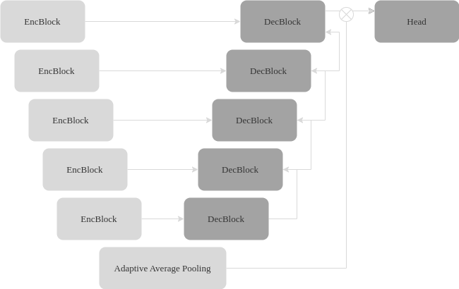
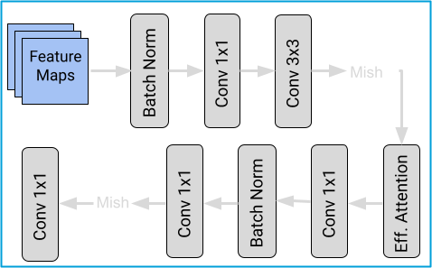
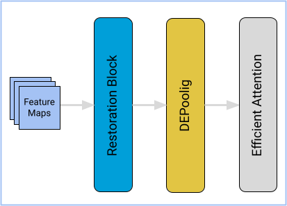
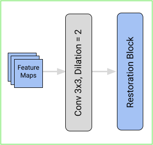

  
### URDE-Net:
Das URDE-Net ist ein auf U-Net basierendes Restaurationsnetzwerk, speziell entwickelt für die Restaurierung medizinischer Bilder. Es besteht aus einem Encoder- und einem Decoder-Teil, wobei es Features aus zunehmend tieferen Ebenen extrahiert und diese in den parallelen Stufen des Decoders wieder zu einem vollständigen Bild rekonstruiert.

---

  
### Restaurations-Block:
Das Kernmodul des URDE-Nets ist der Restaurations-Block, bestehend aus einer Reihe aufeinanderfolgender Schichten. Eine 1x1 Convolution passt die eingehenden Features auf eine bestimmte Dimension an, gefolgt von einer 3x3 Convolution und der Mish-Aktivierungsfunktion. Innerhalb dieses Moduls wird Efficient-Attention integriert, um wichtige Features hervorzuheben. Anschließend folgen 1x1 Pointwise-Convolutions, wobei eine Skip-Connection eingebaut wird, um die Features aus früheren Schichten in die Verarbeitung einzubeziehen.

---

  
### Encoder-Block:
Jede Stufe des Encoder beinhaltet einen EncBlock, der aus einer Sequenz von Modulen besteht. Zunächst wird der Restaurations-Block zur Bildwiederherstellung eingesetzt. Danach folgt ein DEPooling-Modul zur Extraktion wertvoller Merkmale und zur Reduktion der räumlichen Dimensionen. Schließlich wird Efficient Attention genutzt, um diese Merkmale für die Verarbeitung in der nächsten Decoder-Stufe hervorzuheben.

---

  
### Decoder-Block:
Im Gegensatz zu den Encoder-Modulen beginnt das Decoder-Modul mit einer 3x3 dilatierten Convolution, um das rezeptive Feld zu erweitern. Danach folgt wiederum der Restaurations-Block, der hier jedoch nicht tiefer in die Materie eindringt. Die Dimensionen des Inputs entsprechen hierbei denen des Outputs. 
